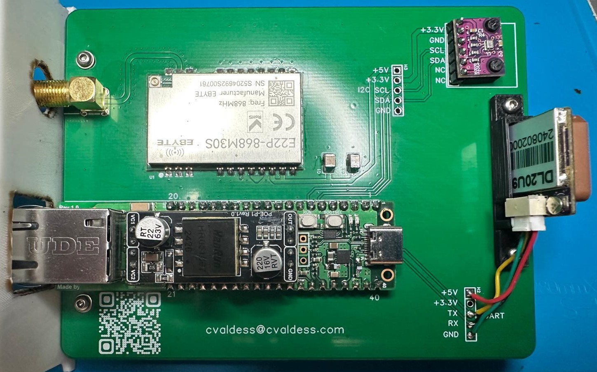
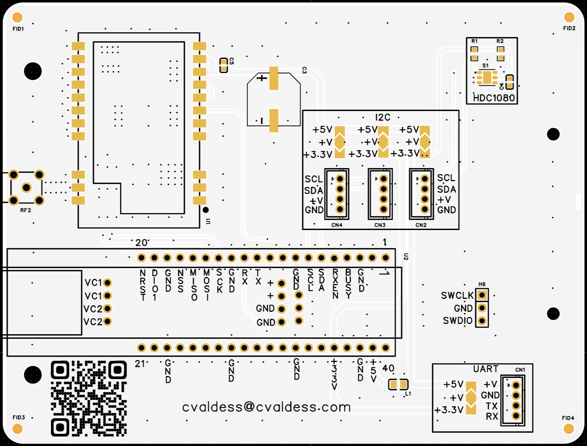
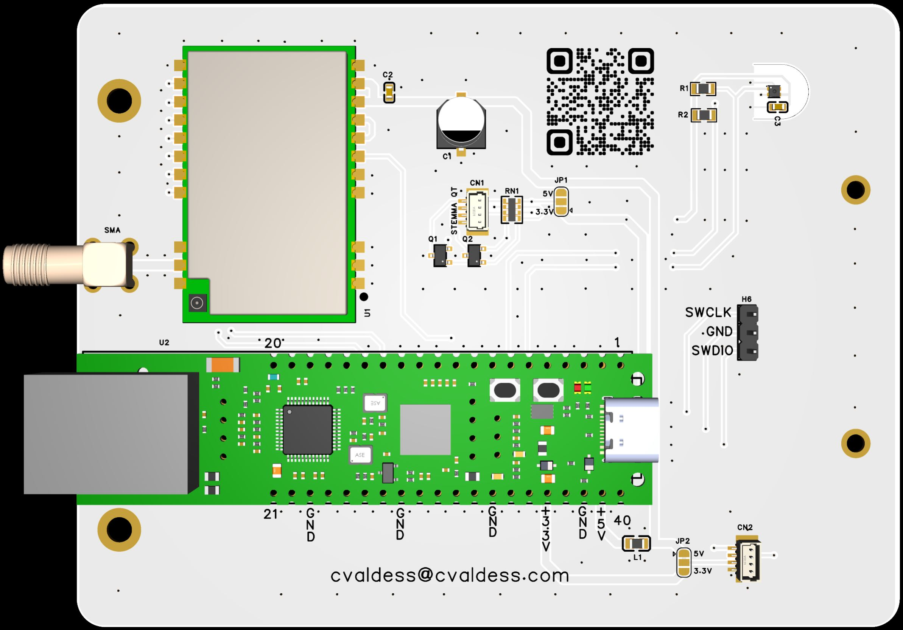

# Wiznet_5500_EVB_Pico2_E22P

A custom PCB carrier board built around the **WIZnet W5500-EVB-Pico2** (an RP2350 with an **on-board W5500 Ethernet** controller) and an **Ebyte E22P LoRa module**, in a single compact design for Meshtastic applications and a low-cost Ethernet MQTT Gateway.

## License

This project is licensed under the [GNU General Public License v2.0](LICENSE).

## Author

**@cvaldess** — [cvaldess@cvaldess.com](mailto:cvaldess@cvaldess.com) - [meshtastic.cvaldess.com](https://meshtastic.cvaldess.com)

## PCB

[JLCPCB](https://jlcpcb.com/?from=MJCHJNNSFFPCJAEEP)

## Features

- **WIZnet W5500-EVB-Pico2** — RP2350-based microcontroller with dual-core Arm Cortex-M33 / RISC-V and an **on-board W5500** hardwired TCP/IP Ethernet controller (no external SPI Ethernet module required)
- **WIZPoE-P1** - Compact PoE module compliant with IEEE802.3af, supporting Mode A and Mode B
- **Ebyte E22P (868M30S)** — LoRa transceiver module (900 MHz, 30 dBm) for long-range wireless communication
- **BMP280 sensor header** — Dedicated footprint (H1) for a BMP280 temperature and pressure sensor via I2C
- **I2C expansion header** (H3) — +5V, +3.3V, SCL, SDA, GND for additional I2C peripherals
- **UART expansion header** (H2) — +5V, +3.3V, TX, RX, GND for serial communication
- **Decoupling capacitors** — 100 µF and 10 µF for power supply filtering
- **PoE PD** - Power Supply.

## Board Images

| 3D Render | Assembled |
|:---------:|:---------:|
|  |  |

## Schematic

The full schematic is available as a SVG file:

- [SCH-W5500_evb_Pico2-E22P.svg](SCH-W5500_evb_Pico2-E22P.svg)

## Bill of Materials

| Component | Description | Quantity |
|-----------|-------------|:--------:|
| [WIZnet W5500-EVB-Pico2](https://shop.wiznet.eu/en/w5500-evb-pico2.html) | RP2350 microcontroller board with on-board W5500 Ethernet | 1 |
| [WIZPoE-P1](https://shop.wiznet.eu/en/wizpoe-p1.html) | Compact PoE module compliant with IEEE802.3af, supporting Mode A and Mode B | 1 |
| [Ebyte E22-868M30S](https://s.click.aliexpress.com/e/_c3ABeS7X) | SX1262 Wireless Transceiver LoRa Module (30 dBm) | 1 |
| [BMP280 module](https://s.click.aliexpress.com/e/_c3lamruN) | I2C temperature & pressure sensor | 1 |
| [C1 — 470µF](https://s.click.aliexpress.com/e/_c2I8FhOZ) | Capacitor ALUM POLY 470uF ±20% 16V SMD | 1 |
| [C2 — 100nF](https://s.click.aliexpress.com/e/_c2I8FhOZ) | Ceramic capacitor | 1 |
| [Pin headers](https://s.click.aliexpress.com/e/_c3xaLyyp) | 2.54 mm male/female headers | As needed |
| [PoE Injector 802.3af](https://s.click.aliexpress.com/e/_c3LHjvOt) | 802.3af PoE Injector | 1 |

## Pin Mapping

### W5500 Ethernet (SPI0) — on-board

| W5500 Pin | Pico 2 GPIO |
|-----------|-------------|
| MISO      | GP16        |
| CS        | GP17        |
| SCK       | GP18        |
| MOSI      | GP19        |
| RST       | GP20        |

### Ebyte E22P LoRa (SPI1)

| E22P Pin | Pico 2 GPIO |
|----------|-------------|
| SCK      | GP10        |
| MOSI     | GP11        |
| MISO     | GP12        |
| CS       | GP13        |
| RST      | GP15        |
| DIO1/IRQ | GP14        |
| BUSY     | GP2         |
| RXEN     | GP3 (held HIGH — LNA/PA enable) |
| TXEN     | bridged from DIO2 on the module |

### BMP280 Sensor (I2C) — H1

| BMP280 Pin | Signal |
|------------|--------|
| VCC        | +3.3V  |
| GND        | GND    |
| SCL        | I2C SCL|
| SDA        | I2C SDA|

### I2C Expansion — H3

| Pin | Signal |
|-----|--------|
| 1   | +5V    |
| 2   | +3.3V  |
| 3   | SCL    |
| 4   | SDA    |
| 5   | GND    |

### UART Expansion — H2

| Pin | Signal |
|-----|--------|
| 1   | +5V    |
| 2   | +3.3V  |
| 3   | TX     |
| 4   | RX     |
| 5   | GND    |

## Firmware

Pre-built Meshtastic firmware (v2.8.0.1b2191f) for the WIZnet W5500-EVB-Pico2 + E22P hardware. This version includes the "Use with client.meshtastic.org" feature. Choose your installation method:

### Method 1: Direct USB flash (UF2)
Hold the BOOTSEL button while connecting the board via USB, then drag-and-drop the UF2 file onto the RP2350 drive that appears.

- [Download .uf2 file](https://meshfiles.cvaldess.com/firmware-wiznet_5500_evb_pico2_e22p-2.8.0.1b2191f.uf2)

### Method 2: Ethernet OTA utility
Update an already-deployed node over the network using the [Ethernet OTA utility](https://github.com/meshtastic/firmware/pull/10136). Download the BIN file and upload it through the utility.

- [Download .bin file](https://meshfiles.cvaldess.com/firmware-wiznet_5500_evb_pico2_e22p-2.8.0.1b2191f.bin)

### Method 3:
In our Client Area you can easy Flah it and Configure, also can protect your image with custom PSK.

 - [Client Area](https://clientarea.cvaldess.com/)

## Use Cases

- Meshtastic mesh network
- Low cost MQTT Gateway
- Remote environmental monitoring (temperature, pressure)
- LoRa-based sensor networks with Ethernet gateway
- Industrial IoT data collection nodes
- Weather station with wired and wireless connectivity
