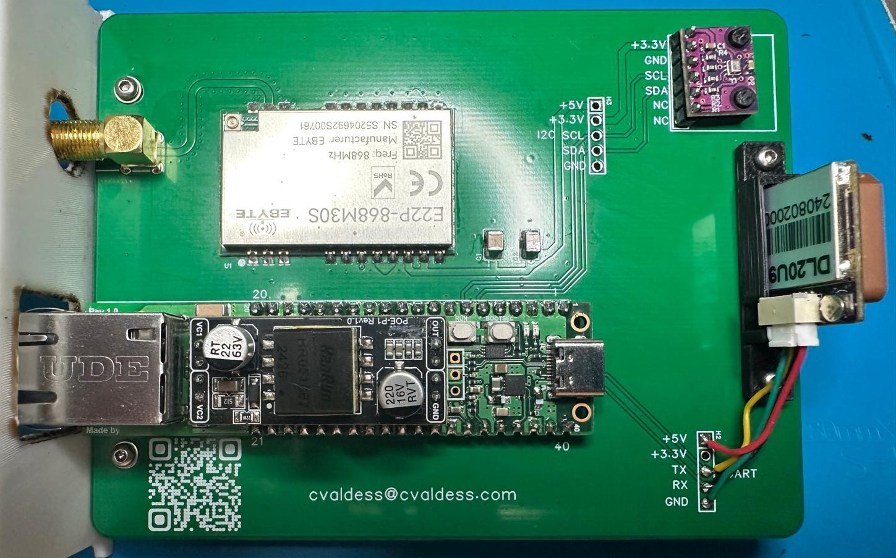
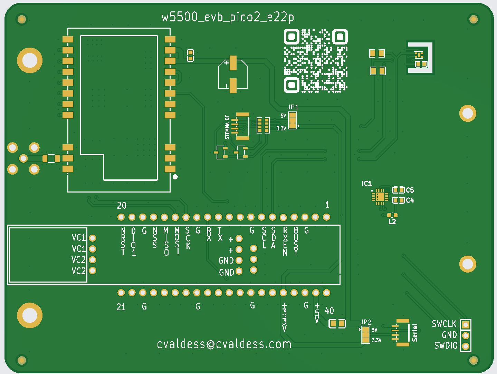
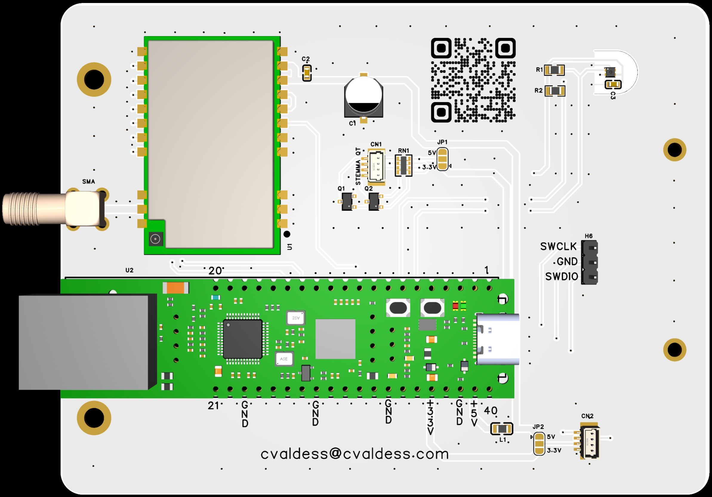
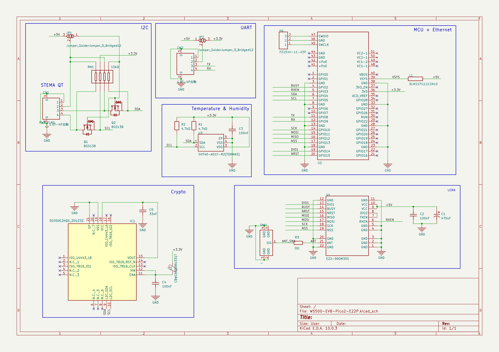

# Wiznet_5500_EVB_Pico2_E22P

A custom PCB carrier board built around the **WIZnet W5500-EVB-Pico2** (an RP2350 with an **on-board W5500 Ethernet** controller) and an **Ebyte E22P LoRa module**, in a single compact design for Meshtastic applications, low-cost Ethernet MQTT Gateway and APRS iGate/Digipeater.

## Where to buy

Everything needed to build this board yourself is in this repository, under the GPL. If you would
rather skip the sourcing and the soldering, assembled units are available:

**[Buy an assembled board →](https://meshtastic.cvaldess.com/nmwiznet)** — €69.99, built, flashed and
tested before it ships. Ships from Spain to the EU.

Nothing is held back for the sale: the schematic, the bill of materials and the pin mapping are all
here, and the same design sent to any board house gives you the same board.

> Meshtastic is a trademark of Meshtastic LLC. This board is an independent design, not
> affiliated with or endorsed by Meshtastic LLC.

## License

This project is licensed under the [GNU General Public License v2.0](LICENSE).

## Author

**@cvaldess** — [cvaldess@cvaldess.com](mailto:cvaldess@cvaldess.com) - [meshtastic.cvaldess.com](https://meshtastic.cvaldess.com)

## PCB

[JLCPCB](https://jlcpcb.com/?from=MJCHJNNSFFPCJAEEP)

## Features

- **WIZnet W5500-EVB-Pico2** — RP2350-based microcontroller with dual-core Arm Cortex-M33 / RISC-V and an **on-board W5500** hardwired TCP/IP Ethernet controller (no external SPI Ethernet module required)
- **WIZPoE-P1** - Compact PoE module compliant with IEEE802.3af, supporting Mode A and Mode B
- **Ebyte E22P (868M30S)** — LoRa transceiver module (900 MHz, 30 dBm) for long-range wireless communication
- **BMP280 sensor header** — Dedicated footprint (H1) for a BMP280 temperature and pressure sensor via I2C
- **I2C expansion header** (H3) — +5V, +3.3V, SCL, SDA, GND for additional I2C peripherals
- **UART expansion header** (H2) — +5V, +3.3V, TX, RX, GND for serial communication
- **Decoupling capacitors** — 100 µF and 10 µF for power supply filtering
- **PoE PD** - Power Supply.

## Board Images

| 3D Render | Assembled |
|:---------:|:---------:|
|  |  |

## Schematic

The full schematic is available as a SVG file:

## Bill of Materials

| Component | Description | Quantity |
|-----------|-------------|:--------:|
| [WIZnet W5500-EVB-Pico2](https://shop.wiznet.eu/en/w5500-evb-pico2.html) | RP2350 microcontroller board with on-board W5500 Ethernet | 1 |
| [WIZPoE-P1](https://shop.wiznet.eu/en/wizpoe-p1.html) | Compact PoE module compliant with IEEE802.3af, supporting Mode A and Mode B | 1 |
| [Ebyte E22-868M30S](https://s.click.aliexpress.com/e/_c3ABeS7X) | SX1262 Wireless Transceiver LoRa Module (30 dBm) | 1 |
| [BMP280 module](https://s.click.aliexpress.com/e/_c3lamruN) | I2C temperature & pressure sensor | 1 |
| [C1 — 470µF](https://s.click.aliexpress.com/e/_c2I8FhOZ) | Capacitor ALUM POLY 470uF ±20% 16V SMD | 1 |
| [C2 — 100nF](https://s.click.aliexpress.com/e/_c2I8FhOZ) | Ceramic capacitor | 1 |
| [Pin header](https://s.click.aliexpress.com/e/_c3xaLyyp) | 2.54 mm male/female headers | As needed |
| [PoE Injector 802.3af](https://s.click.aliexpress.com/e/_c3LHjvOt) | 802.3af PoE Injector | 1 |

## Pin Mapping

### W5500 Ethernet (SPI0) — on-board

| W5500 Pin | Pico 2 GPIO |
|-----------|-------------|
| MISO      | GP16        |
| CS        | GP17        |
| SCK       | GP18        |
| MOSI      | GP19        |
| RST       | GP20        |

### Ebyte E22P LoRa (SPI1)

| E22P Pin | Pico 2 GPIO |
|----------|-------------|
| SCK      | GP10        |
| MOSI     | GP11        |
| MISO     | GP12        |
| CS       | GP13        |
| RST      | GP15        |
| DIO1/IRQ | GP14        |
| BUSY     | GP2         |
| RXEN     | GP3 (held HIGH — LNA/PA enable) |
| TXEN     | bridged from DIO2 on the module |

### SHT40 Sensor (I2C) — H1

| SHT40 Pin  | Signal |
|------------|--------|
| VCC        | +3.3V  |
| GND        | GND    |
| SCL        | I2C SCL|
| SDA        | I2C SDA|

### I2C Expansion (STEMMA QT) — CN1

| Pin | Signal |
|-----|--------|
| 1   | GND    |
| 2   | VCC    |
| 3   | SDA    |
| 4   | SCL    |

JP1 - VCC Voltge select (Default 3.3V)

### UART Expansion (JST SH 1.00 mm) — CN2

| Pin | Signal |
|-----|--------|
| 1   | GND    |
| 2   | VCC    |
| 3   | TX     |
| 4   | RX     |

JP2 - VCC Voltage select (Default 5V)

## Meshtastic Firmware

Pre-built Meshtastic firmware (v2.8.0.0770000) for the WIZnet W5500-EVB-Pico2 + E22P hardware. This version includes the "Use with client.meshtastic.org" feature. Choose your installation method:

### Method 1: Direct USB flash (UF2)
Hold the BOOTSEL button while connecting the board via USB, then drag-and-drop the UF2 file onto the RP2350 drive that appears.

- [Download .uf2 file](https://meshfiles.cvaldess.com/firmware-wiznet_5500_evb_pico2_e22p.uf2)

### Method 2: Ethernet OTA utility
Update an already-deployed node over the network using the [Ethernet OTA utility](https://github.com/meshtastic/firmware/pull/10136). Download the BIN file and upload it through the utility.

- [Download .bin file](https://meshfiles.cvaldess.com/firmware-wiznet_5500_evb_pico2_e22p.bin)

### Method 3:
In our Client Area you can easy Flah it and Configure, also can protect your image with custom PSK.

 - [Client Area](https://clientarea.cvaldess.com/)

## CA2RXU LoRa APRS iGate/Digipeater firmware

Pre-built CA2RXU LoRa APRS iGate/Digipeater firmware for the WIZnet W5500-EVB-Pico2 + E22P-433M30S hardware

### Method 1: Direct USB flash (UF2)
Hold the BOOTSEL button while connecting the board via USB, then drag-and-drop the UF2 file onto the RP2350 drive that appears.

 - [Download .bin file](https://meshfiles.cvaldess.com/rp2350_igate.bin)

 ### Method 2: Ethernet OTA utility
Update an already-deployed node over the network using the node Web OTA.

 - [Download .uf2 file](https://meshfiles.cvaldess.com/rp2350_igate.uf2)

## Use Cases
- Meshtastic mesh network
- Low cost MQTT Gateway
- APRS iGate/Digipeater
- Remote environmental monitoring (temperature, pressure)
- LoRa-based sensor networks with Ethernet gateway
- Industrial IoT data collection nodes
- Weather station with wired and wireless connectivity
